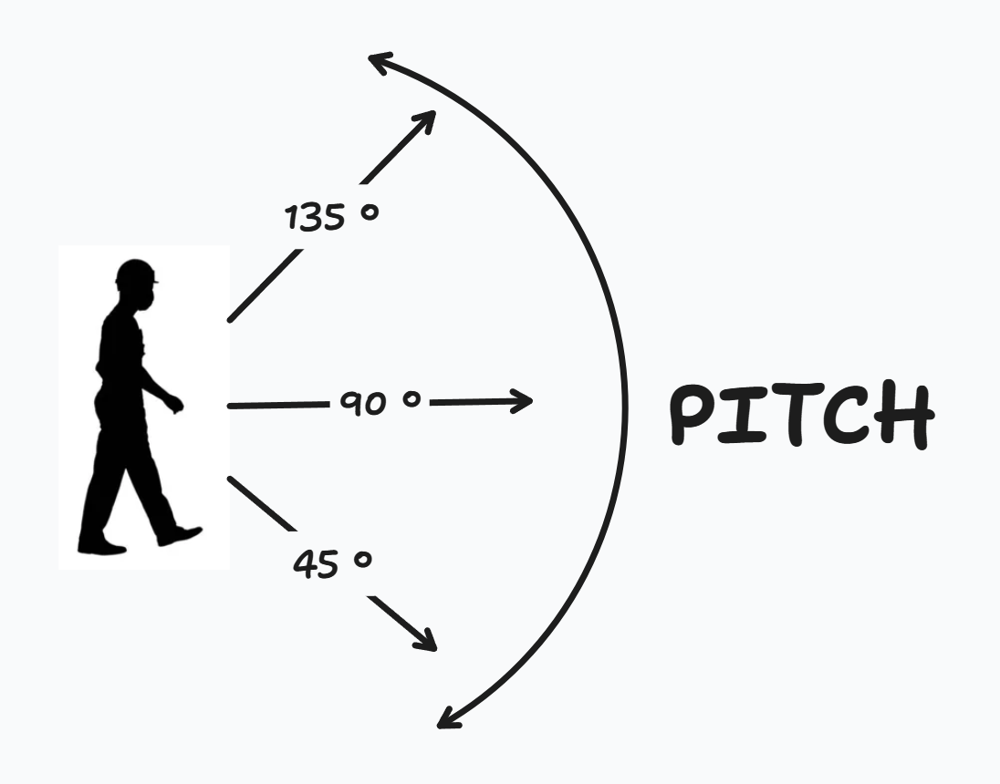
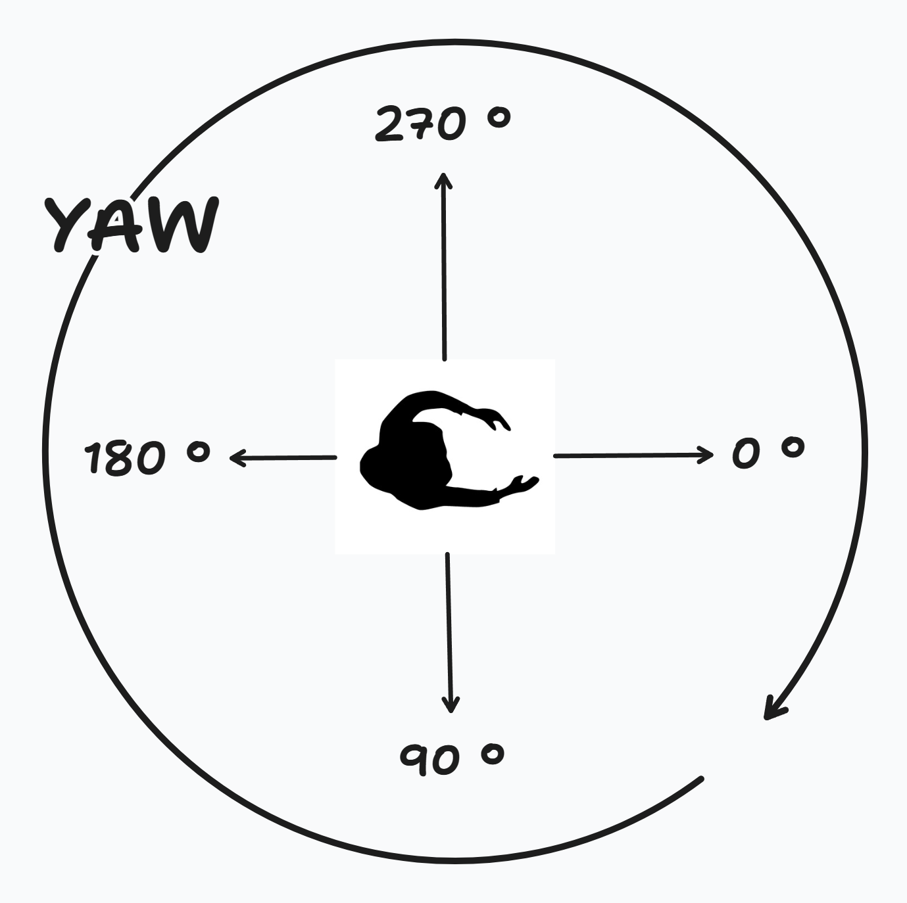

# Panorama to Plane Projection Converter


## Table of Contents

- [Panorama to Plane Projection Converter](#panorama-to-plane-projection-converter)
  - [Table of Contents](#table-of-contents)
  - [Overview](#overview)
  - [Features](#features)
  - [How It Works](#how-it-works)
  - [Prerequisites](#prerequisites)
  - [Installation](#installation)
    - [1. Clone the Repository](#1-clone-the-repository)
    - [2. Create a Virtual Environment (Recommended)](#2-create-a-virtual-environment-recommended)
    - [3. Install Dependencies](#3-install-dependencies)
  - [Usage](#usage)
    - [Command-Line Arguments](#command-line-arguments)
      - [**Required Arguments**](#required-arguments)
      - [**Optional Arguments**](#optional-arguments)
    - [Example Commands](#example-commands)
    - [Running the Command](#running-the-command)
  - [Output Files](#output-files)
  - [Troubleshooting](#troubleshooting)
    - [Common Issues and Solutions](#common-issues-and-solutions)
  - [License](#license)
  - [Acknowledgments](#acknowledgments)

## Overview

The **Panorama to Plane Projection Converter** is a Python-based tool designed to transform panoramic images into plane (rectilinear) projections. This conversion is essential for applications in virtual reality, gaming, photography, and more, where a standard perspective view is required from a 360-degree panorama.

By adjusting parameters such as Field of View (FOV), yaw, and pitch, users can generate multiple perspective views from a single panoramic image, facilitating versatile usage across various platforms and mediums.

## Features

- **Flexible Projection Parameters:** Customize FOV, yaw, and pitch to generate specific perspectives.
- **Batch Processing:** Convert multiple panorama images simultaneously with support for parallel processing.
- **Multiple Output Formats:** Save projected images in popular formats like PNG, JPG, and JPEG.
- **High Performance:** Leveraging optimized libraries like OpenCV for efficient image processing.
- **User-Friendly Command-Line Interface:** Easily configure and execute conversions through simple CLI commands.
- **Progress Tracking:** Monitor processing status with real-time progress bars.

## How It Works

The script transforms panoramic (spherical) images into plane (rectilinear) projections using mathematical transformations. Here's a high-level overview of the process:

1. **Coordinate Mapping:** 
   - The script maps Cartesian coordinates from the output plane to spherical coordinates based on specified yaw and pitch angles.
   - Rotation matrices are applied to accurately adjust the view direction.

2. **Color Interpolation:**
   - For each pixel in the output image, corresponding coordinates in the panorama are determined.
   - OpenCV's `remap` function interpolates colors efficiently, ensuring high-quality projections.

3. **Parallel Processing:**
   - Utilizing Python's `ProcessPoolExecutor`, the script processes multiple images and yaw angles concurrently, significantly reducing processing time for large batches.

4. **Output Generation:**
   - The projected images are saved with descriptive filenames indicating the applied parameters, facilitating easy identification and organization.

## Prerequisites

- **Python Version:** Python 3.7 or higher is required.
- **Operating System:** Cross-platform (Windows, macOS, Linux).

## Installation

### 1. Clone the Repository

```bash
git clone https://github.com/Maxiviper117/360-to-planer-images.git

cd 360-to-planer-images
```

### 2. Create a Virtual Environment (Recommended)

Creating a virtual environment ensures that project dependencies are isolated.

```bash
python -m venv venv
```

Activate the virtual environment:

- **On Windows:**

  ```bash
  venv\Scripts\activate
  ```

- **On macOS and Linux:**

  ```bash
  source venv/bin/activate
  ```

### 3. Install Dependencies

Install the required Python libraries using `pip`:

```bash
pip install -r requirements.txt
```

*If a `requirements.txt` file is not provided, install dependencies individually:*

```bash
pip install pillow numpy scipy opencv-python tqdm
```

## Usage

The script is executed via the command line using `panorama_to_plane.py`. It supports both single and batch processing of panoramic images.

### Command-Line Arguments

```bash
python panorama_to_plane.py --input_path <INPUT_PATH> [OPTIONS]
```

#### **Required Arguments**

- `--input_path`: 
  - **Description:** Path to the directory containing input panorama images.
  - **Type:** `str`
  - **Example:** `--input_path ./input_images`

#### **Optional Arguments**

- `--output_path`: 
  - **Description:** Directory to save the output plane-projected images.
  - **Type:** `str`
  - **Default:** `output_images`
  - **Example:** `--output_path ./output_images`

- `--output_format`: 
  - **Description:** Format of the output images.
  - **Choices:** `png`, `jpg`, `jpeg`
  - **Default:** Inherits from input image format.
  - **Example:** `--output_format png`

- `--FOV`: 
  - **Description:** Field of View in degrees.
  - **Type:** `int`
  - **Default:** `90`
  - **Example:** `--FOV 120`

- `--output_width`: 
  - **Description:** Width of the output image in pixels.
  - **Type:** `int`
  - **Default:** `1000`
  - **Example:** `--output_width 1920`

- `--output_height`: 
  - **Description:** Height of the output image in pixels.
  - **Type:** `int`
  - **Default:** `1500`
  - **Example:** `--output_height 1080`

- `--pitch`: 
  - **Description:** Pitch angle in degrees (1-179).
  - **Type:** `int`
  - **Default:** `90`
  - **Example:** `--pitch 45`

- `--yaw_angles`: 
  - **Description:** List of yaw angles in degrees (0-360).
  - **Type:** `int` (list)
  - **Default:** `[0, 60, 120, 180, 240, 300]`
  - **Example:** `--yaw_angles 0 90 180 270`

### Example Commands

1. **Basic Usage:**

   Convert all panorama images in `input_images` with default settings.

   ```bash
   python panorama_to_plane.py --input_path ./input_images
   ```

2. **Specify Output Directory and Format:**

   Save output images in `converted_images` directory with `png` format.

   ```bash
   python panorama_to_plane.py --input_path ./input_images --output_path ./converted_images --output_format png
   ```

3. **Customize FOV, Output Size, Pitch, and Yaw Angles:**

   Convert images with a 120-degree FOV, output size of 1920x1080 pixels, pitch of 45 degrees, and yaw angles at 0, 90, 180, and 270 degrees.

   ```bash
   python panorama_to_plane.py --input_path ./input_images --FOV 120 --output_width 1920 --output_height 1080 --pitch 45 --yaw_angles 0 90 180 270
   ```

4. **Complete Example with Multiple Yaw Angles:**

   ```bash
   python panorama_to_plane.py \
       --input_path ./input_images \
       --output_path ./output_images \
       --output_format jpg \
       --FOV 100 \
       --output_width 1280 \
       --output_height 720 \
       --pitch 60 \
       --yaw_angles 0 45 90 135 180 225 270 315
   ```

### Running the Command

1. **Activate the Virtual Environment:**

   Ensure you're in the project directory and the virtual environment is activated.

   - **On Windows:**

     ```bash
     venv\Scripts\activate
     ```

   - **On macOS and Linux:**

     ```bash
     source venv/bin/activate
     ```

2. **Execute the Script:**

   Use one of the example commands or customize your own based on your requirements.

   ```bash
   python panorama_to_plane.py --input_path ./input_images
   ```

3. **Monitor Progress:**

   The script utilizes `tqdm` to display a progress bar, indicating the processing status of images.

4. **Completion Message:**

   Upon successful completion, you should see a log message:

   ```
   [INFO] Processing completed.
   ```

   The output images will be available in the specified `output_path` directory.

## Output Files

Each output image will be named following this pattern:

```
<original_filename>_pitch<pitch>_yaw<yaw>_fov<FOV>.<format>
```

**Example:**

For an input file named `panorama1.jpg` with a pitch of `60`, yaw of `90`, FOV of `100`, and output format `jpg`, the output file will be:

```
panorama1_pitch60_yaw90_fov100.jpg
```

This naming convention helps in identifying the projection parameters used for each output image.

## Troubleshooting

### Common Issues and Solutions

1. **Module Not Found Error**

   **Error Message:**

   ```
   ModuleNotFoundError: No module named 'cv2'
   ```

   **Solution:**

   Ensure all dependencies are installed within your virtual environment.

   ```bash
   pip install opencv-python
   ```

2. **Permission Denied Error**

   **Error Message:**

   ```
   PermissionError: [Errno 13] Permission denied: 'output_images'
   ```

   **Solution:**

   - Verify that you have write permissions for the output directory.
   - If the directory exists, ensure it's not read-only.
   - Run the terminal or command prompt with appropriate permissions.

3. **No Images Found Warning**

   **Warning Message:**

   ```
   [WARNING] No images found in ./input_images with extensions ['*.jpg', '*.jpeg', '*.png'].
   ```

   **Solution:**

   - Check that the `input_images` directory contains images with supported extensions.
   - Ensure that the path provided to `--input_path` is correct.
   - Verify that file extensions are in lowercase or adjust the script to handle case-insensitive extensions.

4. **High Memory Usage or Slow Performance**

   **Potential Causes:**

   - Processing very large images.
   - Running too many parallel processes.

   **Solutions:**

   - Reduce the `output_width` and `output_height` to lower values.
   - Limit the number of parallel workers by adjusting the `max_workers` parameter in the script.
   - Ensure that your system has sufficient RAM and CPU resources.

5. **Output Images Are Blank or Incorrectly Mapped**

   **Potential Causes:**

   - Incorrect yaw or pitch values.
   - Issues in coordinate transformations.

   **Solutions:**

   - Double-check the yaw and pitch values for correctness.
   - Review the rotation matrix implementation in the script.
   - Test the script with a single image and known parameters to isolate issues.

## License

This project is licensed under the [MIT License](LICENSE). See the [LICENSE](LICENSE) file for details.


<div style="display: flex; justify-content: center; align-items: center; gap: 20px;">
    
    
</div>


https://github.com/user-attachments/assets/a8761ea4-53b9-4d83-91a5-44fbcf115194

