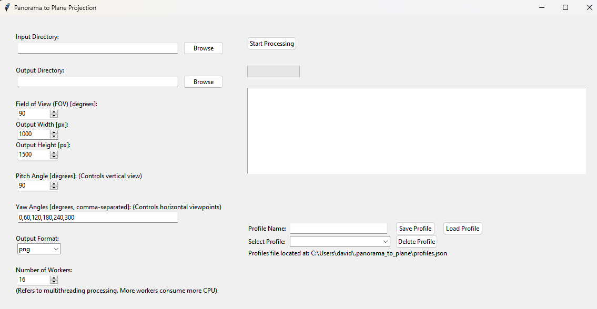

# Panorama to Plane Projection Converter

This repository contains tools for transforming a 360-degree panoramic image into planar images, allowing extraction of specific views from the panorama. The converter generates multiple planar images with specified yaw angles, field of view, and pitch angle, providing a way to visualize different perspectives from a single panorama image.

This implementation is based on the Medium blog post by Coding Ballad: [Unwrapping the View: Transforming 360° Panoramas into Intuitive Videos with Python](https://blogs.codingballad.com/unwrapping-the-view-transforming-360-panoramas-into-intuitive-videos-with-python-6009bd5bca94)

## Table of Contents

- [Panorama to Plane Projection Converter](#panorama-to-plane-projection-converter)
  - [Table of Contents](#table-of-contents)
  - [Overview](#overview)
  - [Features](#features)
  - [How It Works](#how-it-works)
  - [Usage Options](#usage-options)
    - [Option 1: Using the Compiled Executable](#option-1-using-the-compiled-executable)
    - [Option 2: Running the Python Script](#option-2-running-the-python-script)
      - [Prerequisites](#prerequisites)
      - [Installation](#installation)
      - [Usage](#usage)
    - [Option 3: Using the Compiled GUI Executable](#option-3-using-the-compiled-gui-executable)
      - [Download](#download)
      - [Setup](#setup)
      - [Usage](#usage-1)
  - [Command-Line Arguments](#command-line-arguments)
    - [Required Arguments](#required-arguments)
    - [Optional Arguments](#optional-arguments)
  - [Examples](#examples)
    - [Running the Python Script](#running-the-python-script)
    - [Running the Compiled Executable](#running-the-compiled-executable)
    - [Output Files](#output-files)
  - [Troubleshooting](#troubleshooting)
    - [Common Issues and Solutions](#common-issues-and-solutions)
  - [License](#license)
- [Yaw and Pitch Angle Illustrations](#yaw-and-pitch-angle-illustrations)
- [GUI](#gui)

## Overview

The **Panorama to Plane Projection Converter** is a tool designed to transform panoramic images into plane (rectilinear) projections. This conversion is essential for applications in virtual reality, gaming, photography, and more, where a standard perspective view is required from a 360-degree panorama.

By adjusting parameters such as Field of View (FOV), yaw, and pitch, users can generate multiple perspective views from a single panoramic image, facilitating versatile usage across various platforms and mediums.

## Features

- **Flexible Projection Parameters:** Customize FOV, yaw, and pitch to generate specific perspectives.
- **Batch Processing:** Convert multiple panorama images simultaneously with support for parallel processing.
- **Multiple Output Formats:** Save projected images in popular formats like PNG, JPG, and JPEG.
- **High Performance:** Leveraging optimized libraries for efficient image processing.
- **User-Friendly Interface:** Easily configure and execute conversions.
- **Progress Tracking:** Monitor processing status with real-time progress indicators.

## How It Works

The converter transforms panoramic (spherical) images into plane (rectilinear) projections using mathematical transformations. Here's a high-level overview of the process:

1. **Coordinate Mapping:**

   - The tool maps Cartesian coordinates from the output plane to spherical coordinates based on specified yaw and pitch angles.
   - Rotation matrices are applied to accurately adjust the view direction.

2. **Color Interpolation:**

   - For each pixel in the output image, corresponding coordinates in the panorama are determined.
   - Efficient interpolation ensures high-quality projections.

3. **Parallel Processing:**

   - Utilizing optimized processing techniques, the tool processes multiple images and yaw angles concurrently, significantly reducing processing time for large batches.

4. **Output Generation:**
   - The projected images are saved with descriptive filenames indicating the applied parameters, facilitating easy identification and organization.

## Usage Options

You can use the **Panorama to Plane Projection Converter** in three ways:

1. **Option 1: Using the Compiled Executable**

   For users who prefer a straightforward approach without setting up a Python environment.

2. **Option 2: Running the Python Script**

   For users who want to run the code directly or modify it.

3. **Option 3: Using the Compiled GUI Executable**

   For users who prefer a graphical user interface without dealing with command-line arguments.

---

### Option 1: Using the Compiled Executable

We provide a compiled executable `panorama_to_plane.exe` for Windows users, attached to the [latest GitHub release](https://github.com/Maxiviper117/360-to-planer-images/releases). This option allows you to use the converter without installing Python or any dependencies.

**Steps to Use the Executable:**

1. **Download the Executable:**

   - Visit the [latest release page](https://github.com/Maxiviper117/360-to-planer-images/releases) and download `panorama_to_plane.exe`.

2. **Prepare Your Images:**

   - Place your panoramic images in a folder, e.g., `input_images`.

3. **Open Command Prompt:**

   - Navigate to the directory containing `panorama_to_plane.exe`.

4. **Run the Executable with Desired Options:**

   ```bash
   panorama_to_plane.exe --input_path <INPUT_PATH> [OPTIONS]
   ```

   Replace `<INPUT_PATH>` with the path to your input images folder, and include any optional arguments as needed.

**Example Command:**

```bash
panorama_to_plane.exe --input_path ./input_images --output_path ./output_images --FOV 120 --pitch 45 --yaw_angles 0 90 180 270
```

**Notes:**

- Ensure that you have the necessary permissions to execute the file.
- The executable supports the same command-line arguments as the Python script.

**Adding the Executable to Windows PATH (Optional):**

To run `panorama_to_plane.exe` from any directory in the terminal, you can add its folder to the Windows system PATH.

1. **Locate the Folder** containing `panorama_to_plane.exe`.
2. **Copy the Path**:
   - Right-click the folder, then select **Properties**. Copy the folder path shown in the **Location** field.
3. **Edit System Environment Variables**:
   - Open the **Start Menu**, search for "Environment Variables", and select **Edit the system environment variables**.
4. **Update the PATH**:
   - In the **System Properties** window, click on **Environment Variables**.
   - In the **System variables** section, scroll down and select **Path**, then click **Edit**.
   - Click **New**, paste the folder path, and click **OK** to save.
5. **Verify**:
   - Open a new command prompt and type `panorama_to_plane.exe`. If it runs, you've successfully added it to PATH.

---

### Option 2: Running the Python Script

This option is for users who want to run the script directly or make modifications.

#### Prerequisites

- **Python Version:** Python 3.7 or higher is required.
- **Operating System:** Cross-platform (Windows, macOS, Linux).

#### Installation

1. **Clone the Repository**

   ```bash
   git clone https://github.com/Maxiviper117/360-to-planer-images.git

   cd 360-to-planer-images
   ```

2. **Create a Virtual Environment (Recommended)**

   Creating a virtual environment ensures that project dependencies are isolated.

   ```bash
   python -m venv venv
   ```

   Activate the virtual environment:

   - **On Windows:**

     ```bash
     venv\Scripts\activate
     ```

   - **On macOS and Linux:**

     ```bash
     source venv/bin/activate
     ```

3. **Install Dependencies**

   Install the required Python libraries using `pip`:

   ```bash
   pip install -r requirements.txt
   ```

   _If a `requirements.txt` file is not provided, install dependencies individually:_

   ```bash
   pip install pillow numpy scipy opencv-python tqdm
   ```

#### Usage

The script is executed via the command line using `app/panorama_to_plane.py`. It supports both single and batch processing of panoramic images.

Use the following command:

```bash
python app/panorama_to_plane.py --input_path <INPUT_PATH> [OPTIONS]
```

Replace `<INPUT_PATH>` with the path to your input images folder, and include any optional arguments as needed.

---

### Option 3: Using the Compiled GUI Executable

We provide a compiled GUI executable `panorama_to_plane-gui.exe` for Windows users, attached to the [latest GitHub release](https://github.com/Maxiviper117/360-to-planer-images/releases). This option allows you to use the converter with a graphical user interface without installing Python or any dependencies.

#### Download

- Visit the [latest release page](https://github.com/Maxiviper117/360-to-planer-images/releases) and download `panorama_to_plane-gui.exe`.

#### Setup

- Move the `panorama_to_plane-gui.exe` file to a dedicated folder on your system.

#### Usage

- Double-click `panorama_to_plane-gui.exe` to launch the GUI application.
- Use the graphical interface to select your input images and configure the desired parameters.
- Start the conversion process through the GUI.

**Note:**

- The GUI version does not use command-line arguments. All configurations are done through the interface.

---

## Command-Line Arguments

**These arguments are only used for `app/panorama_to_plane.py` and the compiled `panorama_to_plane.exe` (Option 1 and Option 2).**

### Required Arguments

- `--input_path`:
  - **Description:** Path to the directory containing input panorama images.
  - **Type:** `str`
  - **Example:** `--input_path ./input_images`

### Optional Arguments

- `--output_path`:
  - **Description:** Directory to save the output plane-projected images.
  - **Type:** `str`
  - **Default:** `output_images`
  - **Example:** `--output_path ./output_images`

- `--output_format`:
  - **Description:** Format of the output images.
  - **Choices:** `png`, `jpg`, `jpeg`
  - **Default:** Inherits from input image format.
  - **Example:** `--output_format png`

- `--FOV`:
  - **Description:** Field of View in degrees.
  - **Type:** `int`
  - **Default:** `90`
  - **Example:** `--FOV 120`

- `--output_width`:
  - **Description:** Width of the output image in pixels.
  - **Type:** `int`
  - **Default:** `1000`
  - **Example:** `--output_width 1920`

- `--output_height`:
  - **Description:** Height of the output image in pixels.
  - **Type:** `int`
  - **Default:** `1500`
  - **Example:** `--output_height 1080`

- `--pitch`:
  - **Description:** Pitch angle in degrees (1-179).
  - **Type:** `int`
  - **Default:** `90`
  - **Example:** `--pitch 45`

- `--yaw_angles`:
  - **Description:** List of yaw angles in degrees (0-360).
  - **Type:** `int` (list)
  - **Default:** `[0, 60, 120, 180, 240, 300]`
  - **Example:** `--yaw_angles 0 90 180 270`

---

## Examples

### Running the Python Script

1. **Basic Usage:**

   Convert all panorama images in `input_images` with default settings.

   ```bash
   python app/panorama_to_plane.py --input_path ./input_images
   ```

2. **Specify Output Directory and Format:**

   Save output images in `converted_images` directory with `png` format.

   ```bash
   python app/panorama_to_plane.py --input_path ./input_images --output_path ./converted_images --output_format png
   ```

3. **Customize FOV, Output Size, Pitch, and Yaw Angles:**

   Convert images with a 120-degree FOV, output size of 1920x1080 pixels, pitch of 45 degrees, and yaw angles at 0, 90, 180, and 270 degrees.

   ```bash
   python app/panorama_to_plane.py --input_path ./input_images --FOV 120 --output_width 1920 --output_height 1080 --pitch 45 --yaw_angles 0 90 180 270
   ```

### Running the Compiled Executable

1. **Basic Usage:**

   ```bash
   panorama_to_plane.exe --input_path ./input_images
   ```

2. **Specify Output Directory and Format:**

   ```bash
   panorama_to_plane.exe --input_path ./input_images --output_path ./converted_images --output_format png
   ```

3. **Complete Example with Multiple Yaw Angles:**

   ```bash
   panorama_to_plane.exe --input_path ./input_images --output_path ./output_images --output_format jpg --FOV 100 --output_width 1280 --output_height 720 --pitch 60 --yaw_angles 0 45 90 135 180 225 270 315
   ```

**Note:** Use backslash (`\`) for line continuation in Linux/macOS. For Windows Command Prompt, write the command in a single line.

### Output Files

Each output image will be named following this pattern:

```
<original_filename>_pitch<pitch>_yaw<yaw>_fov<FOV>.<format>
```

**Example:**

For an input file named `panorama1.jpg` with a pitch of `60`, yaw of `90`, FOV of `100`, and output format `jpg`, the output file will be:

```
panorama1_pitch60_yaw90_fov100.jpg
```

This naming convention helps in identifying the projection parameters used for each output image.

---

## Troubleshooting

### Common Issues and Solutions

1. **Executable Won't Run**

   **Error Message:**

   ```
   This app can't run on your PC.
   ```

   **Solution:**

   - Ensure that you're running the executable on a compatible Windows system (e.g., 64-bit Windows 10 or higher).
   - If you have antivirus software, it might block the executable; check your antivirus logs and whitelist the app if necessary.

2. **Module Not Found Error (Python Script)**

   **Error Message:**

   ```
   ModuleNotFoundError: No module named 'cv2'
   ```

   **Solution:**

   Ensure all dependencies are installed within your virtual environment.

   ```bash
   pip install opencv-python
   ```

3. **Permission Denied Error**

   **Error Message:**

   ```
   PermissionError: [Errno 13] Permission denied: 'output_images'
   ```

   **Solution:**

   - Verify that you have write permissions for the output directory.
   - If the directory exists, ensure it's not read-only.
   - Run the terminal or command prompt with appropriate permissions.

4. **No Images Found Warning**

   **Warning Message:**

   ```
   [WARNING] No images found in ./input_images with extensions ['*.jpg', '*.jpeg', '*.png'].
   ```

   **Solution:**

   - Check that the `input_images` directory contains images with supported extensions.
   - Ensure that the path provided to `--input_path` is correct.
   - Verify that file extensions are in lowercase or adjust the script to handle case-insensitive extensions.

5. **High Memory Usage or Slow Performance**

   **Potential Causes:**

   - Processing very large images.
   - Running too many parallel processes.

   **Solutions:**

   - Reduce the `output_width` and `output_height` to lower values.
   - Limit the number of parallel workers by adjusting the processing parameters.
   - Ensure that your system has sufficient RAM and CPU resources.

6. **Output Images Are Blank or Incorrectly Mapped**

   **Potential Causes:**

   - Incorrect yaw or pitch values.
   - Issues in coordinate transformations.

   **Solutions:**

   - Double-check the yaw and pitch values for correctness.
   - Review the rotation matrix implementation if you're modifying the code.
   - Test the tool with a single image and known parameters to isolate issues.

---

## License

This project is licensed under the [MIT License](LICENSE). See the [LICENSE](LICENSE) file for details.

---
# Yaw and Pitch Angle Illustrations
<div style="display: flex; justify-content: center; align-items: center; gap: 20px;">
    
    
</div>

# GUI


